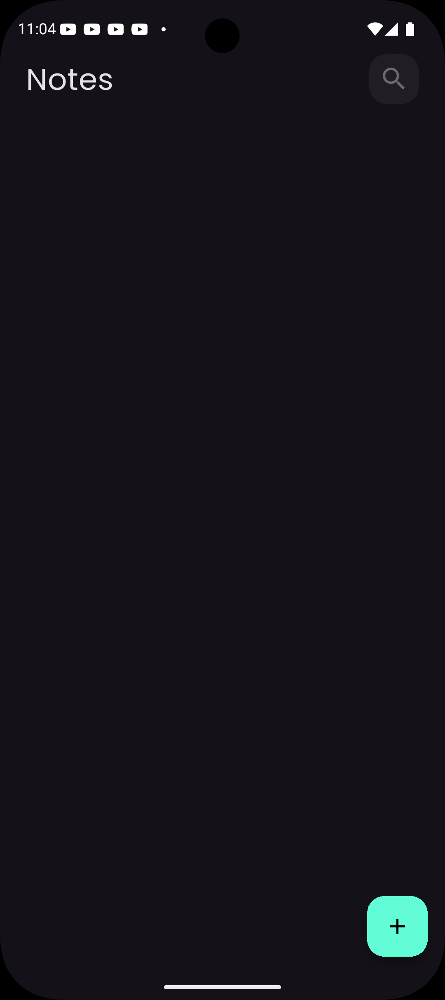
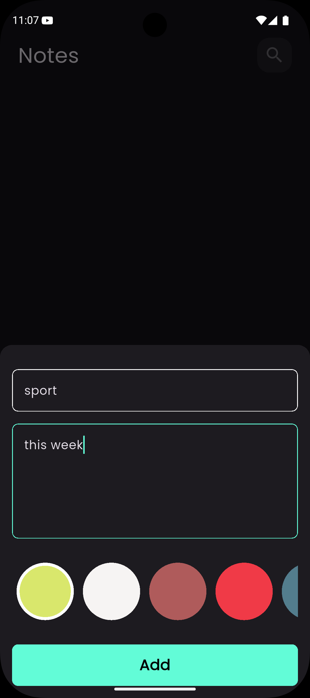
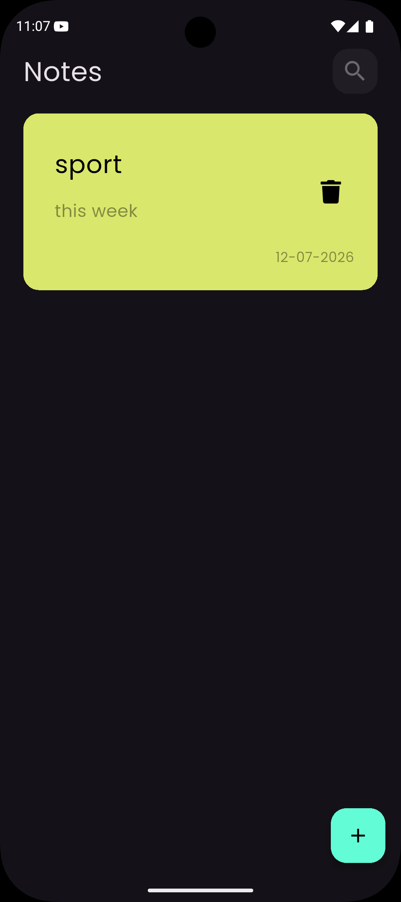
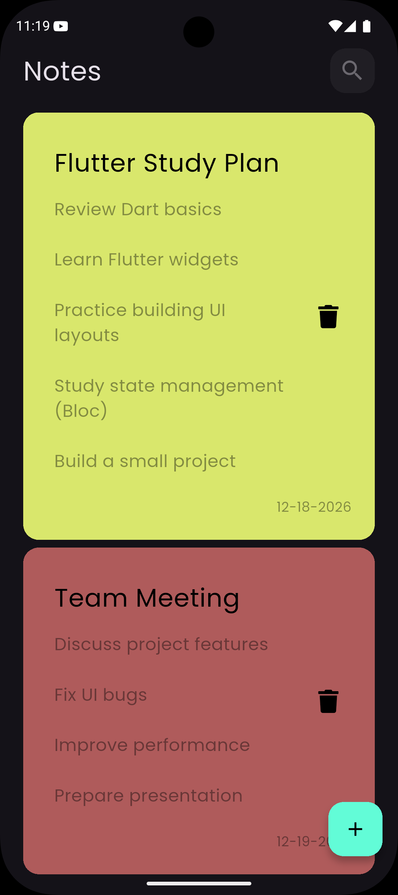

# 📝 Notes App

A modern and responsive **Notes Application built with Flutter** that allows users to create, edit, and manage their notes efficiently.

The application provides a clean and intuitive user interface with a beautiful dark theme while storing notes locally using a fast and lightweight database. The project follows a modular architecture and uses the Bloc pattern for scalable and maintainable state management.

---

## ✨ Features

- **Create and Edit Notes** – Easily add and modify your notes
- **Local Data Storage** – Notes are stored locally using Hive database
- **Modern Dark UI** – Clean and minimal dark theme with Poppins font
- **Fast Performance** – Lightweight and optimised for smooth usage
- **State Management** – Efficient state handling using Flutter Bloc
- **Cross Platform** – Works on Android, iOS, Web, Windows, macOS, and Linux
- **Loading Indicators** – Smooth loading states using Modal Progress HUD

---

## 🛠️ Tech Stack

- **Framework**: Flutter (Dart)
- **State Management**: Flutter Bloc
- **Local Database**: Hive
- **Database Integration**: hive_flutter
- **Icons**: Font Awesome
- **Loading Indicators**: modal_progress_hud_nsn
- **Date Formatting**: intl

---

## 📁 Project Structure

```
lib/
├── cubits/                  # BLoC state management
├── models/                  # Data models (NoteModel)
├── views/                   # Application screens
├── widgets/                 # Reusable UI components
├── constants.dart           # App constants
├── main.dart                # Application entry point
└── simple_bloc_observer.dart # Bloc observer for debugging
```

---

## 🚀 Getting Started

### Prerequisites

Make sure you have installed:

- Flutter SDK **3.5.4 or higher**
- Dart SDK (included with Flutter)
- Android Studio or VS Code with Flutter extension

---

### Installation

1. Clone or download the project

2. Navigate to the project folder

3. Install dependencies:

```bash
flutter pub get
```

4. Run the application:

```bash
flutter run
```

---

### Building for Production

To build the application for release:

```bash
flutter build apk --release
```

Or for iOS:

```bash
flutter build ios --release
```

Or for Web:

```bash
flutter build web --release
```

Or for Desktop:

```bash
flutter build windows --release
flutter build macos --release
flutter build linux --release
```

---

## 🧠 Application Logic

The application handles:

- Creating and editing notes
- Saving notes locally using **Hive**
- Managing application states using **Bloc/Cubit**
- Handling loading states with **Modal Progress HUD**
- Displaying notes in a clean and responsive UI

---

## 🎨 UI Components

The UI is built using reusable widgets including:

- **Note Item Widget** – Displays a single note
- **Notes List View** – Displays all notes in a scrollable list
- **Add/Edit Note Screen** – Interface for creating and updating notes
- **Custom AppBar & Buttons** – Reusable UI components

---

## 🤝 Contributing

Contributions are welcome! Feel free to fork the repository and submit pull requests for improvements.

### Possible Enhancements

- Add **search functionality**
- Implement **note categories**
- Add **dark/light theme switching**
- Add **cloud sync**
- Implement **note pinning**
- Add **animations for better UX**

---

## 📷 Screenshots

<div align="center">
  
  
</div>

<div align="center">
  
  
</div>

---

## 📜 License

This project is open source and available for learning and development purposes.

---

## 📞 Contact

If you have any questions, feedback, or suggestions, feel free to get in touch. I’m happy to help!